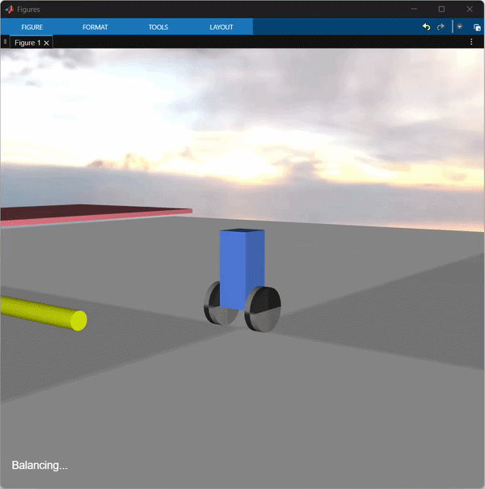

# PHX Toolbox

**Object-oriented MATLAB API for 3D rigid-body physics.**

PHX Toolbox is a rigid-body physics extension layered over the [Bullet](https://github.com/bulletphysics/bullet3)
physics engine. 

It allows you to built models from physical objects such as bodies with different
shapes, joints, springs, ropes, force fields or custom elements.  The model is drawn
directly into MATLAB axes and can be simulated immediately with one command.

[](https://matlab.mathworks.com/open/github/v1?repo=Humusoft/phx&project=PHXToolbox.prj&file=examples/phxex_buggy.m)

> ⚠️ **Technical preview.** PHX is published as a technical preview for evaluation
> and feedback. APIs may change between releases.

## Features

* Rigid-body dynamics with collisions and contacts (boxes, spheres, cylinders,
cones, capsules, meshes, terrain, imported OBJ/STL, …)
* Joints (revolute, spherical, gear, …), springs and ropes
* Force and field elements (thrusters, resistance, dipole/monopole fields)
* Logging, tracing and measurement tools, interactive viewer
* Simulink block for closed-loop co-simulation
* Headless stepping for batch runs and experiments

PHX Toolbox also includes a set of AI skills for use with common AI agents.



▶ [Watch the demo video](https://humusoft.cz/videos/blog/phx-preview/phx_demos.mp4)

## Requirements

* MATLAB **R2025a or newer**
* Simulink (only for the Simulink block)
* Windows, Linux, or macOS (prebuilt engine binaries are bundled for all three)

## Installation

Download the latest `PHXToolbox.mltbx` from the
[Releases](../../releases) page and double-click it in MATLAB (or use the
Add-On Manager). MATLAB installs the toolbox and adds it to the path.

## Quick start

```matlab
clf; view(3); axis equal; grid on; camlight headlight;

phx.Body("Type", "static");            % ground
phx.Body("Position", [0.6 -0.5 2]);    % a body that will fall onto it

sim = phx.Simulation;
sim.step(1, 100, 1);                   % simulate 1 s in 100 substeps, redrawing
```

More examples are in the [`examples/`](examples) folder (all named `phxex_*`), and
a guided introduction is in [`doc/GettingStarted.mlx`](doc/GettingStarted.mlx).

## License

PHX is a source-available **technical preview**, licensed under the **PHX Preview
License** (see [`LICENSE.txt`](LICENSE.txt)). In short: you may read and adapt the
MATLAB (`.m`) source and use PHX for free, including commercially — but it is not
for sale and may not be used to build a competing product. The physics engine is
provided as a compiled binary.

PHX bundles the Bullet Physics engine under the zlib License; see
[`NOTICE.txt`](NOTICE.txt) for attribution.

A separate **commercial license** will be available from HUMUSOFT s.r.o. for uses the
Preview License does not permit. Contact us at phx@humusoft.cz.

## Contributing

During the technical preview we welcome bug reports and feedback via the issue
tracker, but we are not yet accepting external code contributions. See
[`CONTRIBUTING.md`](CONTRIBUTING.md).

## About

PHX is developed by [HUMUSOFT s.r.o.](https://www.humusoft.cz).

