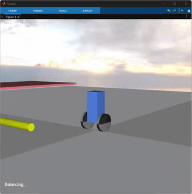
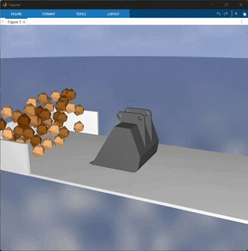
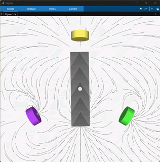
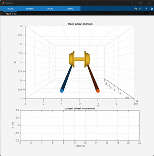
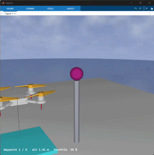
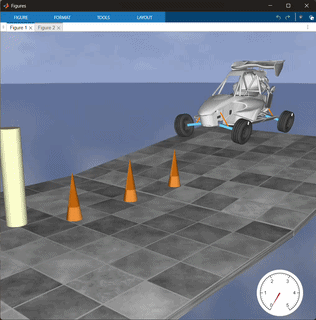

# PHX Toolbox

**Object-oriented MATLAB API and Simulink blocks for 3D rigid-body physics.**

PHX Toolbox allows you to build models from physical objects such as bodies with different
shapes, joints, springs, ropes, force fields, sensors, or custom elements. The model is drawn
directly into MATLAB axes and can be simulated immediately with one command. Simulation is
powered by the [Bullet](https://github.com/bulletphysics/bullet3) physics engine, enhanced
to allow co-simulation with custom MATLAB elements. 

[](https://matlab.mathworks.com/open/github/v1?repo=Humusoft/phx&project=PHXToolbox.prj&file=examples/phxex_buggy.m)

> ⚠️ **Technical preview.** PHX is published as a technical preview for evaluation
> and feedback. APIs may change between releases.

## Features

* Rigid-body dynamics with collisions and contacts — boxes, spheres, cylinders, cones,
capsules, extrusions, revolutions, rocks, terrain heightfields and imported OBJ/STL/PLY meshes
* Joints (revolute, prismatic, cylindrical, spherical, gear, fixed, bushing and a generic
6-DOF joint with limits), springs and ropes routed over pulleys
* Motorized joints — an angular or linear velocity target with a torque or force limit,
which doubles as a pure torque/force source or a holding brake
* Force and field elements (thrusters, resistance, buoyancy, dipole/monopole fields)
* Prefab assemblies — arenas, jointed chains, scattered bodies, brick walls, URDF import
* Sensing and analysis — loggers, traces, measurements, detection zones, ray sensors
* Automation and control — timed scripts, per-step callbacks, closed-loop control from MATLAB
* Interactive viewer with textures, sky backgrounds, tracking cameras and projected shadows
* Simulink block for closed-loop co-simulation
* Headless stepping for batch runs, optimization and experiments

PHX Toolbox also includes a set of AI skills for use with common AI agents. They are
installed with the toolbox in its `skills` folder (and live here in `.claude/skills`);
see **AI agent skills** in the User Guide for how to point your assistant at them.

 
 
 

## Requirements

* MATLAB **R2025a or newer**
* Simulink (only for the Simulink block)
* Windows, Linux, or macOS (prebuilt engine binaries are bundled for all three)

## Installation

Download the latest `PHXToolbox.mltbx` from the
[Releases](../../releases) page and double-click it in MATLAB (or use the
Add-On Manager). MATLAB installs the toolbox and adds it to the path.

## Quick start

```matlab
clf; view(3); axis equal; grid on; camlight headlight;

phx.Body("Type", "static");            % ground
phx.Body("Position", [0.6 -0.5 2]);    % a body that will fall onto it

sim = phx.Simulation;
sim.step(1, 100, 1);                   % simulate 1 s in 100 substeps, redrawing
```

## Documentation

Once installed, the full documentation is in the MATLAB Help browser under
**Supplemental Software → PHX Toolbox**: a Getting Started topic, a User Guide covering
core concepts, bodies and shapes, joints, forces, assemblies, logging, automation, the
interactive viewer and the AI agent skills, plus an illustrated Examples gallery and the
class reference. `phxdoc phx.Body` opens a single reference page directly.

Over 50 ready-to-run examples are in the [`examples/`](examples) folder (all named
`phxex_*`) — each one is a single command in the Command Window. A guided introduction
is in [`doc/GettingStarted.mlx`](doc/GettingStarted.mlx).

## License

PHX is a source-available **technical preview**, licensed under the **PHX Preview
License** (see [`LICENSE.txt`](LICENSE.txt)). In short: you may read and adapt the
MATLAB (`.m`) source and use PHX for free, including commercially — but it is not
for sale and may not be used to build a competing product. The physics engine is
provided as a compiled binary.

PHX bundles the Bullet Physics engine under the zlib License; see
[`NOTICE.txt`](NOTICE.txt) for attribution.

A separate **commercial license** will be available from HUMUSOFT s.r.o. for uses the
Preview License does not permit. Contact us at phx@humusoft.cz.

## Contributing

During the technical preview we welcome bug reports and feedback via the issue
tracker, but we are not yet accepting external code contributions. See
[`CONTRIBUTING.md`](CONTRIBUTING.md).

## About

PHX is developed by [HUMUSOFT s.r.o.](https://www.humusoft.cz).

